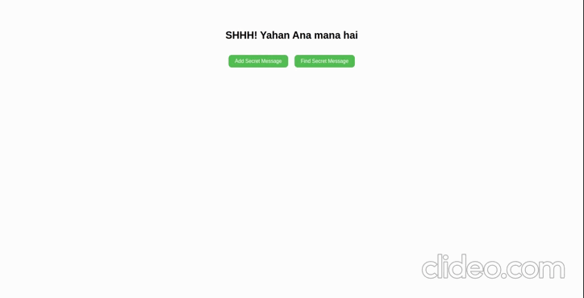

<div align="center">

</div>


<h1 align="center" style="font-size: 80px;" > Secret-Messages-App__(MERN-STACK)<h1>

### Author: [MUHIB ARSHAD](https://github.com/muhib7353)

> Welcome to Secret Messages App, a user-friendly MERN stack application that allows you to send and receive encrypted messages with full input validation, responsive UI, and easy navigation. Server side fully stores data in the backend, data is retrieved via a RESTful API ensuring data is secure and accessible to secret code entered users.

# Features 🚀

- Fully functional MERN stack application
- Allows users to send and receive encrypted messages
- Client-side and server-side functionality
- Seamless user experience
- Full input validation on client side
- Responsive UI design
- Side-by-side component handling for easy navigation
- Data fully stored in the backend
- Data retrieved via a RESTful API
- Powerful and user-friendly application
- Offers a secure way to send and receive encrypted messages

# How to use it 💻

To get started, clone the repository and `install` the dependencies:

## Zero Step

- Open the folder in the `VScode`
- Then open the terminal with the shortcut `ctrl+j`
- After opening Terminal `run` these commands

```sh
git clone https://github.com/muhib7353/Secret-Messages-App-MERN.git
```

## First Step

#### Install and run the server

```sh
cd Backend
npm install
npm start
```

## Second Step

#### Install and run the client

```sh
cd ../
cd Frontend
npm install
npm start
```

This will start the development server and open the app in your default web browser. Now enjoy it.

## Last Step

- Star 🌟 this repository and follow at [muhib7353](https://github.com/muhib7353)

🤝 Contributing

"Feel free to contribute to this repository. If you want to add new features or resolve any issues, you can fork the repository and make changes to the code. If you only want to make changes to the file, you can create a pull request to the master branch. I will review it and, if it meets the necessary requirements, I will merge it into the branch. The same process applies for changes to the main branch as well."

# About me

### 👨‍💻 Muhib Arshad

   <div align="center">
<p align="center">Let's connect!</p>

<a href="https://www.linkedin.com/in/muhib-arshad-85439b242/" target="blank">
    
</a>

<a href="https://medium.com/@muhibarshad123" target="blank">
    
</a>

<a href="https://stackoverflow.com/users/18215817/muhib-arshad?tab=profile" target="blank">
    
</a>

<a href = "https://twitter.com/muhib7353" target="blank">
    
</a>

<a href="https://www.facebook.com/muhib7353/" target="blank">
    
</a>

<a href="https://www.instagram.com/muhib7353/" target="blank">
    
</a>

</div>

## Show your support

If this project was helpful to you, please consider giving it a ⭐️.
You can also follow my GitHub profile to stay updated on my latest projects:
<a href="https://github.com/muhib7353" target="blank">
@muhib7353
</a>

## 📝 License

Copyright © 2022 [Muhib Arshad](https://github.com/muhib7353).

This project is [MIT](https://github.com/muhib7353/Secret-Messages-App/blob/main/License.md) licensed.
